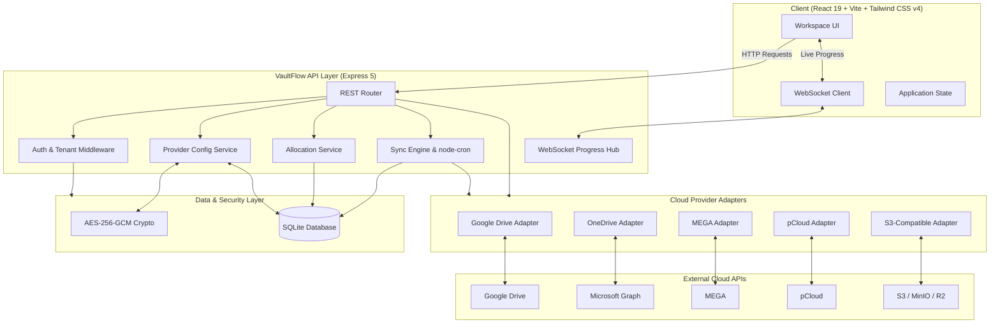

# VaultFlow

[](https://developer.mozilla.org/en-US/docs/Web/JavaScript) [](https://vitejs.dev/) [](https://react.dev/) [](https://tailwindcss.com/) [](https://nodejs.org/) [](https://expressjs.com/) [](https://www.sqlite.org/) [](https://developer.mozilla.org/en-US/docs/Web/API/WebSockets_API)

VaultFlow is a modern, high-performance cloud drive aggregation platform that unifies multiple cloud storage providers into a single, cohesive sovereign workspace. Built with a responsive high-speed frontend and an **Express 5** backend with a modular adapter registry, VaultFlow lets you seamlessly browse, upload, download, preview, search, and manage files across all your personal and enterprise cloud accounts through one intuitive interface.

---

## ✨ Key Features

### ☁️ Multi-Provider Cloud Aggregation
- **Unified Provider Layer**: Connect multiple accounts from diverse services into a normalized virtual filesystem.
- **Supported Providers**: Google Drive, Microsoft OneDrive, MEGA, pCloud, and AWS S3 (or S3-compatible services like MinIO, Cloudflare R2, Backblaze B2).
- **Flexible Connection Models**: Supports standard OAuth 2.0, username/password account authentication, and access key/secret key configurations.

### 🛠️ In-App Dynamic Provider Setup & Testing
- **Zero-Restart Setup**: Configure OAuth app credentials (Client ID, Secret, Redirect URIs) directly from the Web UI without server restarts.
- **Connection Diagnostics**: Test provider API configurations instantly from the browser before connecting user accounts.
- **Dual-Source Configuration**: Supports database-backed encrypted credentials with seamless, zero-downtime fallback to `.env` variables.
- **Admin CLI**: Easily promote administrator accounts via `npm run bootstrap-admin -- <user-email>`.

### 🗂️ Unified Virtual Workspace
- **Virtual Navigation**: Seamless folder hierarchy abstraction spanning distinct cloud accounts.
- **Views**:
  - `Home`: Overview dashboard with storage metrics, recent items, and quick connection statuses.
  - `My Drive`: Full virtual directory tree explorer with breadcrumbs, sorting, and view modes.
  - `Shared with Me`: Aggregated files and folders shared with you across supported accounts (e.g. Google Drive, OneDrive).
  - `Recent`: Quick access to recently modified or opened items across all drives.
  - `Starred`: Favorite files with instant star toggling (synced with provider capabilities where supported).
  - `Quota & Storage`: Interactive storage capacity graphs, provider breakdown, and allocation control.
  - `Landing`: Feature overview, storage aggregation showcase, and interactive savings calculator.

### 📁 Comprehensive File Management
- **Browsing & Search**: Ultra-fast file queries backed by an indexed SQLite metadata mirror.
- **File Lifecycle**: Create folders, rename files/folders, single or bulk deletion with transactional safety.
- **Direct Downloads**: Stream files from providers with correct MIME types and filename headers.
- **Rich In-Browser Previews**: Native streaming preview support for images, video, audio, PDFs, and code/JSON files.
- **Smart Context Menus**: Contextual right-click actions customized based on each provider's underlying capabilities.

### ⬆️ High-Efficiency Upload Engine
- **Streaming Uploads**: Memory-efficient stream piping using `busboy` prevents server buffer exhaustion.
- **Real-Time Progress**: Live upload progress, transfer speeds, and completion notices streamed over WebSocket (`/ws/uploads`).
- **Drag & Drop + Folder Support**: Drag files or complete directory structures directly into the browser.
- **Intelligent Account Allocation**: Automatically routes new uploads to the best storage account according to your configured strategy.

### ⚖️ 5 Smart Storage Allocation Strategies
Distribute files intelligently across your linked accounts:
1. `round_robin`: Evenly rotates new files sequentially across active accounts.
2. `weighted_round_robin`: Allocates files proportionally based on account capacities.
3. `least_used`: Routes uploads to the account with the lowest used storage.
4. `most_free`: Routes uploads to the account with the greatest remaining free space.
5. `manual`: Strict user-defined priority ordering (fills accounts sequentially according to preference).

### 🔄 Synchronous & Scheduled Sync
- **Local Metadata Mirroring**: Fast local index in SQLite eliminates provider API rate-limiting delays.
- **Automated Periodic Sync**: Background delta synchronization powered by `node-cron` (`SYNC_INTERVAL_MINUTES`).
- **Manual Sync On Demand**: Force a synchronisation run anytime from the UI or API (`POST /api/sync/run`).
- **Account Health Reports**: Real-time sync logs and delta reports for auditability.

### 👤 Deployment Modes & Security
- **`local` Mode**: Zero-configuration, single-user mode designed for private home servers, NAS, or personal workstations.
- **`hosted` Mode**: Multi-user production setup with registration, login, profile management, and secure HTTP-only session cookies.
- **Tenant Isolation**: Complete row-level security ensuring all accounts, files, mirrors, and allocation settings are strictly isolated per user.
- **Military-Grade Encryption**: AES-256-GCM encryption for stored refresh tokens, provider credentials, and access keys.

### 🌐 Internationalization & Modern UI
- **Multilingual Support**: Fully localized in English (`en`) and Bahasa Indonesia (`id`) via `vue-i18n`.
- **Dynamic Theming**: Dark and Light mode support powered by Tailwind CSS v4.
- **Keyboard Shortcuts & Modals**: Intuitive navigation with quick modal management and Tabler icons.

---

## ☁️ Supported Providers

| Provider | Status | Integration Model | Auth Mechanism | Star Sync |
| :--- | :---: | :--- | :--- | :---: |
| **Google Drive** | ✅ Active | OAuth 2.0 + Google Drive v3 API | Web OAuth / In-App Setup | Yes |
| **Microsoft OneDrive** | ✅ Active | OAuth 2.0 + Microsoft Graph API | Web OAuth / In-App Setup | No (Local) |
| **MEGA** | ✅ Active | MegaJS Engine | Email & Password | No (Local) |
| **pCloud** | ✅ Active | pCloud REST API | Email & Password | No (Local) |
| **AWS S3 / Compatible** | ✅ Active | AWS SDK v3 (`@aws-sdk/client-s3`) | Endpoint, Bucket, Key & Secret | No (Local) |

> 📖 **Need help configuring developer apps?** Check out the step-by-step setup guides in [`docs/provider-setup.md`](docs/provider-setup.md).

---

## 🏗️ Architecture & How It Works



1. **Client Interaction**: The modern React 19 client interacts with the REST API for account management, metadata browsing, settings, and file streams.
2. **Adapter Registry**: The backend resolves requests through provider-specific adapters, abstracting disparate vendor APIs into a standardized data model.
3. **Storage Allocation**: When uploading, the Allocation Engine determines the optimal cloud account based on user-selected strategies (`most_free`, `round_robin`, `least_used`, etc.).
4. **Streaming Transfers**: File uploads and downloads stream directly through the API server using minimal memory overhead, broadcasting live percentage and byte metrics over WebSocket.
5. **Metadata Sync & Caching**: SQLite maintains an encrypted, indexed mirror of file metadata for sub-millisecond query response times and resilient offline views.

---

## 📁 Project Structure

```text
VaultFlow/
├── backend/
│   ├── src/
│   │   ├── adapters/          # Cloud provider adapter implementations
│   │   ├── config/            # Database initialization and environment parsing
│   │   ├── middleware/        # Authentication, tenant validation, admin checks
│   │   ├── routes/            # Express REST route handlers
│   │   ├── scripts/           # Administrative CLI utilities (bootstrapAdmin.js)
│   │   ├── services/          # Core business logic (auth, files, allocation, sync)
│   │   ├── utils/             # AES-256-GCM encryption and crypto helpers
│   │   ├── app.js             # Express application configuration
│   │   └── server.js          # HTTP & WebSocket server entrypoint
│   ├── tests/                 # Node.js native test suites
│   ├── Dockerfile             # Multi-stage production backend container
│   └── package.json
├── frontend/
│   ├── src/
│   │   ├── assets/            # Logos and icons
│   │   ├── components/        # Modern React UI components
│   │   ├── lib/               # API clients, authentication, utilities
│   │   ├── pages/             # Application pages (Landing, Dashboard, Login, Signup)
│   │   ├── types/             # TypeScript type definitions
│   │   ├── App.tsx            # Main application root
│   │   ├── main.tsx           # React DOM client entrypoint
│   │   └── index.css          # Tailwind CSS styling rules
│   ├── Dockerfile             # Production Nginx SPA container
│   └── package.json
├── docs/
│   └── provider-setup.md      # Detailed developer credential setup guide
├── docker-compose.yml         # Full-stack Docker orchestration
└── package.json               # Root workspace scripts
```

---

## 📋 Requirements

Ensure your environment meets the following specifications:

- **Node.js**: `v20.0.0` or higher (`v22 LTS` recommended)
- **npm**: `v10.0.0` or higher
- **Operating System**: Windows, macOS, or Linux
- **Docker & Docker Compose**: *(Optional)* Required only for containerized deployment

---

## 🛠️ Local Development Setup

### 1. Clone & Install Dependencies
Clone the repository and install dependencies for all workspaces:

```bash
git clone https://github.com/Aviral-09/VaultFlow.git
cd VaultFlow
npm install
```

### 2. Configure Backend Environment
Generate a `.env` configuration file from the template:

```bash
# Windows PowerShell
copy backend\.env.example backend\.env

# Linux / macOS
cp backend/.env.example backend/.env
```

### 3. Configure Environment Variables
Open `backend/.env` and configure key variables:

```env
PORT=8787

# Application Mode:
# 'local'  -> Single-user, no registration required (ideal for personal servers)
# 'hosted' -> Multi-user with authentication, user registration, and session isolation
APP_MODE=local

CORS_ORIGIN=http://localhost:5173
FRONTEND_URL=http://localhost:5173

# Periodic sync interval in minutes
SYNC_INTERVAL_MINUTES=5

# Secret key for AES-256-GCM token and credential encryption (Keep private!)
VAULTFLOW_ENCRYPTION_KEY=replace-with-a-strong-random-encryption-key
VAULTFLOW_SECRET_HALF=replace-with-a-random-half-key

# Auth configuration (used when APP_MODE=hosted)
AUTH_COOKIE_NAME=vaultflow_session
AUTH_SESSION_TTL_HOURS=336
AUTH_SECRET=replace-with-a-strong-auth-secret

# OAuth Provider Credentials (Optional: can also be configured dynamically in the UI)
GOOGLE_CLIENT_ID=
GOOGLE_CLIENT_SECRET=
GOOGLE_REDIRECT_URI=http://localhost:8787/api/accounts/google/callback

ONEDRIVE_CLIENT_ID=
ONEDRIVE_CLIENT_SECRET=
ONEDRIVE_TENANT_ID=common
ONEDRIVE_REDIRECT_URI=http://localhost:8787/api/accounts/onedrive/callback
```

> [!TIP]
> **Dynamic Setup**: You do not have to fill out OAuth variables in `.env` if you prefer to enter and test them securely through the VaultFlow Web UI!

### 4. Start Local Development Servers
Run both backend and frontend concurrently with hot-reloading:

```bash
npm run dev
```

The services will be accessible at:
- 🌐 **Web Client**: [http://localhost:5173](http://localhost:5173)
- 🔌 **API Server**: [http://localhost:8787](http://localhost:8787)
- 📡 **Upload WebSocket**: `ws://localhost:8787/ws/uploads`

### 5. (Hosted Mode) Bootstrap an Administrator
If you are running in `APP_MODE=hosted` and register an account, you can promote your user to an administrator:

```bash
npm run bootstrap-admin -- your-email@example.com
```

---

## 🐳 Docker Deployment

VaultFlow includes complete Docker orchestration featuring a production build of the React frontend served by Nginx alongside the Express API.

### 1. Build and Launch Containers
```bash
docker compose up --build -d
```

### 2. Access the Application
- **Application & API Gateway**: [http://localhost:8080](http://localhost:8080)
- Nginx automatically proxies `/api` and `/ws/uploads` to the internal backend container.
- SQLite data is automatically preserved in the `vaultflow_api_data` persistent Docker volume.

### 3. Stop Containers
```bash
# Stop containers
docker compose down

# Stop containers and purge stored database volume
docker compose down -v
```

---

## 🧪 Testing & Quality Assurance

The backend includes a comprehensive test suite covering OAuth handshakes, space allocation algorithms, token encryption stability, and multi-tenant security isolation:

```bash
# Run all backend tests
npm --prefix backend test
```

---

## 📜 Available Scripts

| Script | Command | Description |
| :--- | :--- | :--- |
| **Root Workspace** | | |
| `npm run dev` | `npm-run-all --parallel dev:api dev:web` | Starts both frontend and backend concurrently |
| `npm run dev:api` | `npm --prefix backend run dev` | Starts Express backend in watch mode (`node --watch`) |
| `npm run dev:web` | `npm --prefix frontend run dev -- --host` | Starts Vite dev server with network host exposure |
| `npm run build` | `npm run build:web` | Builds the frontend for production |
| `npm run bootstrap-admin` | `npm --prefix backend run bootstrap-admin --` | Promotes a user to admin by email |
| `npm start` | `npm --prefix backend start` | Starts Express backend in production mode |
| **Backend Workspace** | | |
| `npm --prefix backend test` | `node --test --test-concurrency=1 tests/*.test.js` | Executes the backend test suite |
| **Frontend Workspace** | | |
| `npm --prefix frontend run preview`| `vite preview` | Previews the production frontend build locally |

---

## 🔌 API Reference

### 🩺 Health & System Sync
- `GET /api/health` — Returns system status, environment validation, auth state, and last sync timestamp.
- `POST /api/sync/run` — Triggers an immediate delta sync across all active cloud accounts.

### 🔐 Authentication & Session (`hosted` mode)
- `GET /api/auth/me` — Fetches current user session profile and permission role.
- `POST /api/auth/register` — Creates a new user account.
- `POST /api/auth/login` — Authenticates user and issues HTTP-only session cookie.
- `POST /api/auth/logout` — Invalidates the current session.

### 🛡️ Admin & Dynamic Provider Management
- `GET /api/admin/providers/:provider` — Returns safe provider configuration status.
- `PUT /api/admin/providers/:provider` — Saves encrypted provider OAuth client credentials to database.
- `POST /api/admin/providers/google/test` — Validates Google OAuth client ID/secret against Google APIs.
- `DELETE /api/admin/providers/:provider` — Removes database credentials and reverts to `.env`.

### ☁️ Cloud Accounts & Connections
- `GET /api/accounts` — Lists all connected cloud accounts with quota and free space.
- `DELETE /api/accounts/:id` — Disconnects an account and purges its local file mirror.
- `GET /api/accounts/:provider/status` — Retrieves integration status for a provider.
- `GET /api/accounts/:provider/connect` — Initiates OAuth consent flow and returns authorization URL.
- `POST /api/accounts/mega/connect` — Connects MEGA account with email/password.
- `POST /api/accounts/pcloud/connect` — Connects pCloud account with email/password.
- `POST /api/accounts/s3/connect` — Connects AWS S3 or S3-compatible bucket via access keys.
- `GET /api/accounts/:provider/callback` — Handles OAuth redirect and completes credential exchange.

### 📁 Virtual File Explorer
- `GET /api/files` — Lists files by virtual path (`?path=/`), search (`?search=query`), recent (`?recent=1`), starred (`?starred=1`), or shared (`?shared=1`).
- `GET /api/files/:id` — Retrieves file details and metadata.
- `GET /api/files/:id/download` — Direct stream download of a file.
- `GET /api/files/:id/preview` — Streams inline preview for images, audio, video, and PDFs.
- `GET /api/files/:id/shared-children` — Lists items inside a shared remote folder.
- `PATCH /api/files/:id/star` — Stars or unstars a file (syncs with provider where supported).
- `PATCH /api/files/:id/rename` — Renames a file or folder.
- `DELETE /api/files/:id` — Deletes a file or directory from the provider.
- `POST /api/files/bulk/delete` — Atomically deletes multiple files across multiple providers.
- `POST /api/files/folders` — Creates a new folder in the allocated account.

### ⬆️ Upload Pipeline
- `POST /api/uploads/initiate` — Initiates upload session and allocates destination account.
- `POST /api/uploads/:uploadId/stream` — Multi-part streaming upload endpoint.
- `WS /ws/uploads?uploadId=...` — WebSocket channel for real-time upload progress.

### ⚙️ User Settings & Storage Allocation
- `GET /api/settings` — Returns user preferences (theme, language).
- `PATCH /api/settings` — Updates user preferences.
- `GET /api/allocation` — Returns active allocation strategy and account ordering.
- `PATCH /api/allocation` — Modifies allocation strategy and manual order priorities.

---

## 🔒 Security Architecture

1. **Token & Secret Encryption**:
   - Provider OAuth refresh tokens, access tokens, MEGA/pCloud credentials, and S3 secret keys are encrypted using **AES-256-GCM** with unique initialization vectors (IVs) and authentication tags.
   - Master encryption keys are derived from `VAULTFLOW_ENCRYPTION_KEY` using SHA-256.
2. **Multi-Tenant Row-Level Security**:
   - Every database query for files, accounts, and settings enforces `user_id` filtering. Users cannot view, modify, or delete resources belonging to other accounts.
3. **Session Cookie Hardening**:
   - Authentication tokens are issued via `HttpOnly`, `SameSite=Lax` cookies with strict expiration TTLs.
4. **Credential Redaction**:
   - API endpoints that report provider connection health or account status strictly redact secrets, displaying only configuration availability flags.

---

## 📄 License

This project is open-source software licensed under the [MIT License](LICENSE).
